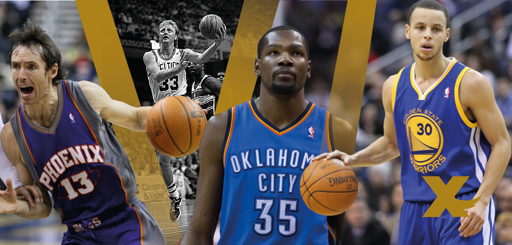

# 
**50-40-90 Club**

Live site: [504090club.info](https://504090club.info/)

Track NBA players on pace to have a 50-40-90 shooting season. This application works in conjunction with the [fifty-forty-ninety-club-tracker](https://github.com/mistersquiish/fifty-forty-ninety-club-tracker) that updates FireBase daily.

Time spent: **20** hours spent in total

## Deploy

## User Stories

The following **required** user stories are complete:

- [x] Users can see current NBA players with the requisite shooting percentages of 50% from the field, 40% from 3pt range, and 90% from the free throw line
- [x] Users can see current NBA players close to the requisite shooting percentages
- [x] Users can view players who have achieved 50-40-90 shooting honors
- [x] Pull data directly from FireBase

## Notes

- Made using Gatsby, React, Firebase, and Material-UI

## License

Copyright [2021] [Henry Vuong]

Licensed under the Apache License, Version 2.0 (the "License");
you may not use this file except in compliance with the License.
You may obtain a copy of the License at

http://www.apache.org/licenses/LICENSE-2.0

Unless required by applicable law or agreed to in writing, software
distributed under the License is distributed on an "AS IS" BASIS,
WITHOUT WARRANTIES OR CONDITIONS OF ANY KIND, either express or implied.
See the License for the specific language governing permissions and
limitations under the License.
